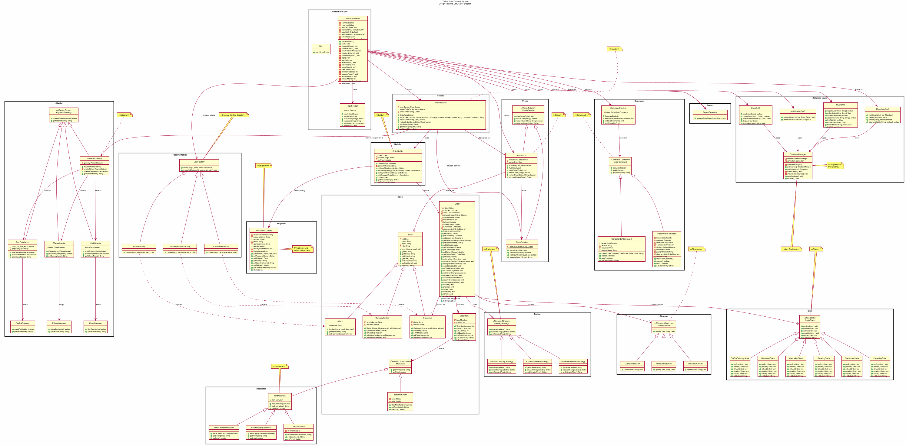

# Project Report: Online Food Ordering System

## Design Patterns Integration Project

---

## 1. Project Title

**FoodieExpress — Online Food Ordering System**

---

## 2. Problem Statement

Modern online food ordering platforms require complex, interconnected subsystems: user management, menu customization, payment processing across multiple gateways, delivery logistics, real-time notifications, and administrative reporting. Building such a system monolithically results in tightly coupled, hard-to-maintain code.

This project demonstrates how **11 Gang of Four (GoF) Design Patterns** — organized into Creational, Structural, and Behavioral categories — can be systematically applied to architect a scalable, maintainable, and extensible online food ordering system. Each pattern addresses a specific design concern, and together they form a coherent, loosely coupled architecture.

---

## 3. Functional Requirements

The system implements the following functional requirements:

| # | Requirement | Description | Pattern(s) Used |
|---|---|---|---|
| FR1 | **User Management** | Create and manage three user types: Customers, Admins, and Delivery Partners | Factory Method |
| FR2 | **Menu & Customization** | Browse base menu items and dynamically add extras (cheese, toppings, drinks) | Decorator |
| FR3 | **Order Construction** | Build complex orders step-by-step with items, quantities, delivery options, and payment | Builder |
| FR4 | **Delivery Options** | Choose between Standard, Express, and Scheduled delivery with different charges | Strategy |
| FR5 | **Payment Processing** | Pay via Khalti, eSewa, or PayPal through a unified interface | Adapter |
| FR6 | **Order Lifecycle** | Track orders through PENDING → CONFIRMED → PREPARING → OUT_FOR_DELIVERY → DELIVERED | State |
| FR7 | **Notifications** | Notify customers, kitchen, and delivery partners on status changes | Observer |
| FR8 | **Order Operations** | Place and cancel orders with undo support for the last operation | Command |
| FR9 | **Simplified Ordering** | Provide a single entry point for the complete ordering workflow | Facade |
| FR10 | **Access Control** | Restrict report generation to ADMIN users; restrict cancellation to CUSTOMER/ADMIN; restrict order placement to CUSTOMER/ADMIN | Proxy |
| FR11 | **Configuration** | Single source of truth for restaurant-wide settings (tax rate, delivery fee, etc.) | Singleton |
| FR12 | **Reporting** | Generate order summary reports with total, active, delivered, cancelled counts, and revenue (DB-backed) | ReportGenerator |
| FR13 | **Profile Management** | Every user can view and edit their own profile: name, email, password, plus role-specific fields (phone/address, department, vehicle number, delivery availability) | UserDAO |

---

## 4. Architecture Design

### 4.1 Layered Architecture

The system follows a layered architecture organized by design pattern concern:

```
┌──────────────────────────────────────────────────────────────────┐
│                     Interactive Console Layer                    │
│            InteractiveMenu (menu-driven user interface)          │
│            InputHelper (input validation utilities)              │
├──────────────────────────────────────────────────────────────────┤
│                     Presentation Layer                          │
│                     Main.java (entry point)                      │
├──────────────────────────────────────────────────────────────────┤
│                     Facade Layer                                │
│               OrderFacade (simplified interface)                │
├──────────────────────────────────────────────────────────────────┤
│                     Business Logic Layer                        │
│  ┌──────────┐ ┌──────────┐ ┌──────────┐ ┌──────────────────┐   │
│  │ Command  │ │  State   │ │ Strategy │ │    Observer      │   │
│  │ Invoker  │ │ Context  │ │  Client  │ │    Subject       │   │
│  └──────────┘ └──────────┘ └──────────┘ └──────────────────┘   │
├──────────────────────────────────────────────────────────────────┤
│                     Domain Model Layer                          │
│        User, Customer, Admin, DeliveryPartner, Order,           │
│        MenuItem, BaseMenuItem, OrderItem                        │
├──────────────────────────────────────────────────────────────────┤
│                     Service / Persistence Layer                 │
│        Proxy (AuthProxy → OrderService), ReportGenerator        │
├──────────────────────────────────────────────────────────────────┤
│                     Database Layer                              │
│        DatabaseManager (PostgreSQL connection singleton)         │
│        UserDAO, MenuItemDAO, OrderDAO, NotificationDAO          │
├──────────────────────────────────────────────────────────────────┤
│                     Integration Layer                           │
│        Adapter (PaymentAdapter → Khalti/eSewa/PayPal)           │
│        Decorator (ItemDecorator → extra cheese/toppings/drinks) │
├──────────────────────────────────────────────────────────────────┤
│                     Configuration Layer                         │
│        Singleton (RestaurantConfig) / Builder (OrderBuilder)    │
│        Factory Method (UserFactory → Customer/Admin/Delivery)   │
└──────────────────────────────────────────────────────────────────┘
```

### 4.2 Pattern Collaboration Flow

A typical order placement flows through multiple patterns in the interactive app:

```
InteractiveMenu.placeOrder()
           ↓
          User selects items from menu (loaded via MenuItemDAO from PostgreSQL)
           ↓
         User customizes items (Decorator: ExtraCheese, ExtraTopping, Drink)
           ↓
         User selects delivery (Strategy: Standard/Express/Scheduled)
           ↓
         → Facade.placeOrder()
              ↓
            Builder.build()          → constructs Order
              ↓
            Adapter.processPayment() → wraps Khalti/eSewa/PayPal
              ↓
            Proxy.placeOrder()       → authorizes user, persists via OrderService
              ↓
            Order.setState()         → transitions via State pattern
              ↓
            Order.notifyObservers()  → notifies Customer/Kitchen via Observer
              ↓
            OrderDAO.saveOrder()     → persists to PostgreSQL database
              ↓
            NotificationDAO.save()   → logs notification to PostgreSQL database
```

---

## 5. Design Pattern Mapping

| Category | Pattern | Class(es) | Role in System |
|---|---|---|---|
| **Creational** | **Singleton** | `RestaurantConfig` | Ensures a single configuration instance for tax rate, delivery fee, restaurant info |
| | **Factory Method** | `UserFactory`, `CustomerFactory`, `AdminFactory`, `DeliveryPartnerFactory` | Encapsulates user object creation; each factory produces a specific User subtype |
| | **Builder** | `OrderBuilder` | Constructs complex Order objects step-by-step with fluent chaining |
| **Structural** | **Adapter** | `PaymentGateway` (Target), `PaymentAdapter` (Adapter factory), `KhaltiAdapter`/`ESewaAdapter`/`PayPalAdapter` (Concrete Adapters), `KhaltiGateway`/`ESewaGateway`/`PayPalGateway` (Adaptees) | Unifies three different payment gateway APIs behind a single interface; PayPal adapter converts NPR to USD |
| | **Facade** | `OrderFacade` | Provides a simplified interface to the ordering subsystem (builder + payment + proxy) |
| | **Proxy** | `IOrderService` (Subject), `OrderService` (RealSubject), `AuthProxy` (Proxy) | Controls access to sensitive operations (cancel, report) based on user role |
| | **Decorator** | `MenuItem` (Component), `BaseMenuItem` (ConcreteComponent), `ItemDecorator` (Decorator), `ExtraCheeseDecorator`/`ExtraToppingDecorator`/`DrinkDecorator` | Dynamically adds extras (cheese, toppings, drinks) to menu items |
| **Behavioral** | **Strategy** | `DeliveryStrategy` (Strategy), `StandardDeliveryStrategy`/`ExpressDeliveryStrategy`/`ScheduledDeliveryStrategy` (ConcreteStrategies) | Encapsulates interchangeable delivery charge calculation algorithms |
| | **Observer** | `OrderObserver` (Observer), `CustomerNotifier`/`RestaurantNotifier`/`DeliveryNotifier` (ConcreteObservers), `Order` (Subject) | Notifies multiple parties when order status changes |
| | **Command** | `OrderCommand` (Command), `PlaceOrderCommand`/`CancelOrderCommand` (ConcreteCommands), `CommandInvoker` (Invoker) | Encapsulates order operations as objects with undo support |
| | **State** | `OrderState` (State), `PendingState`/`ConfirmedState`/`PreparingState`/`OutForDeliveryState`/`DeliveredState`/`CancelledState` (ConcreteStates), `Order` (Context) | Manages order lifecycle state transitions with guard conditions |

---

## 6. Interactive Console Application

The system has been upgraded from a static demo to a fully interactive console application with database persistence.

### Main Menu Flow

```
START → Login/Register → MAIN MENU
                          ├── [Customer] Browse → Customize → Place Order → Track → Cancel
                          ├── [Admin]    View Orders → Process → Reports → Manage Menu
                          └── [Delivery]  View Deliveries → Mark Delivered
```

### Pattern Demonstration in Interactive Flow

| Menu Option | Pattern(s) Demonstrated | How It Works |
|---|---|---|
| Register | Factory Method | UserFactory creates Customer/Admin/DeliveryPartner |
| Customize Item | Decorator | Chained decorators add cheese/toppings/drinks |
| Place Order | Builder + Strategy + Adapter + Facade | OrderBuilder constructs; Strategy calculates delivery; Adapter processes payment; Facade orchestrates |
| Track Orders | State | Displays current order lifecycle state |
| Cancel Order | Command | CancelOrderCommand with undo support via CommandInvoker |
| View Notifications | Observer | Retrieves notifications logged by Observer pattern |
| Process Order | State | Admin transitions order states: CONFIRMED → PREPARING → OUT_FOR_DELIVERY → DELIVERED |
| Generate Report | Proxy | AuthProxy restricts report access to ADMIN role |

## 7. Database Layer

The system uses **PostgreSQL** for persistence (requires a running PostgreSQL 18+ server on localhost:5432).

### Database Schema

The PostgreSQL database `foodordering` is automatically created on first run with the following tables:

| Table | Key Columns | Purpose |
|---|---|---|
| `users` | id, name, email, password, role, phone, address, department, vehicle_number, available | Stores all user accounts |
| `menu_items` | id, name, base_price, available | Menu catalog (pre-populated with 8 items) |
| `orders` | id, customer_id, customer_name, delivery_strategy, payment_method, subtotal, tax_amount, delivery_charge, total_amount, status, created_at | Order records with lifecycle status |
| `order_items` | id, order_id, item_description, unit_price, quantity, total_price | Line items within each order |
| `notifications` | id, order_id, recipient, message, created_at | Notification log for observer pattern |

### Database Access Layer

The `com.foodordering.db` package contains:

- **`DatabaseManager`** (Singleton) — Manages the PostgreSQL connection and schema creation
- **`UserDAO`** — User registration, authentication, lookup
- **`MenuItemDAO`** — Menu item CRUD and availability toggling
- **`OrderDAO`** — Order persistence and status updates
- **`NotificationDAO`** — Notification logging and retrieval

The database is served by a local PostgreSQL instance. Connect via pgAdmin at `localhost:5432`, database `foodordering`, user `postgres`. Credentials and URLs can be overridden via the `FOOD_DB_URL`, `FOOD_DB_USER`, and `FOOD_DB_PASS` environment variables. Delivery partner availability is persisted in the `users.available` column and editable from the delivery partner's Settings menu.

## 8. UML Class Diagram



*Figure 1: Complete UML class diagram showing all 11 design patterns, their classes, interfaces, and relationships.*

The diagram is organized into packages by pattern category:
- **Model** package contains the core domain classes used across all patterns
- Each pattern is in its own package with clear interface/class hierarchies
- Stereotype notes identify each pattern's role (<<Singleton>>, <<Factory Method Creator>>, etc.)
- Inheritance, composition, and dependency relationships are shown between collaborating patterns

---

## 9. Screenshots

### Console Output — Demo Execution

The application produces formatted console output clearly labeling each pattern demonstration. The interface uses a futuristic neon theme — cyan box borders, bold titles, and color-coded status badges (green DELIVERED, red CANCELLED, blue OUT FOR DELIVERY, etc.) — which automatically disables itself in terminals without ANSI color support:

```
╔══════════════════════════════════════════════════════════╗
║       FOODIEEXPRESS - ONLINE FOOD ORDERING SYSTEM       ║
║    Design Patterns Integration Project (Assignment 2)   ║
╚══════════════════════════════════════════════════════════╝

=========================================
  SINGLETON PATTERN - RESTAURANT CONFIG
=========================================
Restaurant   : FoodieExpress
Address      : 123 Food Street, Kathmandu
Phone        : +977-1-4XXXXXX
Hours        : 10:00 AM - 10:00 PM
Tax Rate     : 13.0%
Delivery Fee : NPR 20.00 per km

  (Same instance? true)

=========================================
  FACTORY METHOD PATTERN - USER CREATION
=========================================
User created: Alice Sharma [CUSTOMER] - alice@email.com
User created: Bob Thapa [ADMIN] - bob@foodieexpress.com
User created: Dev Rai [DELIVERY] - dev@email.com

=========================================
  BUILDER PATTERN - ORDER CONSTRUCTION
=========================================
  Customer     : Priya Karki
  Items:
    - Margherita Pizza x 1           NPR 450.00
    - White Sauce Pasta x 2          NPR 700.00
  Subtotal     : NPR 1,150.00
  Tax (13%)    : NPR 149.50
  Delivery     : NPR 70.00
  Total        : NPR 1,369.50
  Payment      : KHALTI

=========================================
  DECORATOR PATTERN - ITEM CUSTOMIZATION
=========================================
  Base item     : Pepperoni Pizza - NPR 500.00
  + Extra Cheese: Pepperoni Pizza + Extra Cheese - NPR 550.00
  + Toppings    : Pepperoni Pizza + Extra Cheese + Extra Toppings - NPR 630.00
  + Drink       : Pepperoni Pizza + Extra Cheese + Extra Toppings + Coke - NPR 730.00

=========================================
  STRATEGY PATTERN - DELIVERY OPTIONS
=========================================
  Standard Delivery
    Distance      : 5.0 km
    Charge        : NPR 100.00
    Estimated     : 30-45 minutes

  Express Delivery
    Distance      : 5.0 km
    Charge        : NPR 200.00
    Estimated     : 15-20 minutes

  Scheduled Delivery
    Distance      : 5.0 km
    Charge        : NPR 0.00
    Estimated     : Scheduled time slot (Free)

=========================================
  ADAPTER PATTERN - PAYMENT PROCESSING
=========================================
  Gateway    : Khalti
  Amount     : NPR 1,500.00
  [Khalti] Processing NPR 1,500.00...
  Status     : SUCCESS

  Gateway    : eSewa
  Amount     : NPR 1,500.00
  [eSewa] Processing NPR 1,500.00...
  Status     : SUCCESS

  Gateway    : PayPal
  Amount     : NPR 1,500.00
  [PayPal] Processing $11.11...
  Status     : SUCCESS

=========================================
  OBSERVER PATTERN - NOTIFICATIONS
=========================================
  [NOTIFICATION to Riya Gurung] Your order has been received!
  [NOTIFICATION to Kitchen] Your order has been received!
  [NOTIFICATION to Delivery Partner] Your order has been received!
  -> All relevant parties notified.

=========================================
  COMMAND PATTERN - ORDER OPERATIONS
=========================================
  Executing: Place Order for Sita Lamichhane

  Payment Method: eSewa
  Amount: NPR 1,100.50
  [eSewa] Processing NPR 1,100.50...
  [AuthProxy] Access granted to Rajesh Hamal (ADMIN) for placing order.
  Order stored in system: ORD-DCC821D6
  Result: Order placed successfully! ID: ORD-DCC821D6

  (Undoing last command...)
  Undoing: Place Order for Sita Lamichhane
  Undo: Cancelling order ORD-DCC821D6
  [AuthProxy] Access granted to Sita Lamichhane (CUSTOMER) for cancellation.

=========================================
  STATE PATTERN - ORDER LIFECYCLE
=========================================
  Initial: PENDING
  Order ORD-DEMO-STATE confirmed.
  After confirm: CONFIRMED
  Order ORD-DEMO-STATE is now being prepared.
  After prepare: PREPARING
  Order ORD-DEMO-STATE is out for delivery.
  After deliver: OUT_FOR_DELIVERY
  Order ORD-DEMO-STATE has been delivered!
  After complete: DELIVERED

=========================================
  FACADE PATTERN - SIMPLIFIED ORDERING
=========================================
  Payment Method: Khalti
  Amount: NPR 645.00
  [Khalti] Processing NPR 645.00...
  [AuthProxy] Access granted to Admin User (ADMIN) for placing order.
  Order stored in system: ORD-1FCF13F6

=========================================
  PROXY PATTERN - ACCESS CONTROL
=========================================
  --- Attempt 1: Regular customer tries to generate report ---
  [AuthProxy] ACCESS DENIED: Only ADMIN can generate reports.
  Result: Access Denied

  --- Attempt 2: Admin generates report ---
  [AuthProxy] Access granted to Admin Boss (ADMIN) for report generation.
  Order Summary Report:
    Total Orders: 0
    Active Orders: 0
    Delivered: 0
    Cancelled: 0

╔══════════════════════════════════════════════════════════╗
║                   END OF DEMONSTRATION                   ║
╚══════════════════════════════════════════════════════════╝
```

---

## 10. Pattern Justification

### 10.1 Creational Patterns

#### Singleton — `RestaurantConfig`
**Problem:** Restaurant configuration (name, address, tax rate, delivery fee) must be globally consistent across the entire system. Multiple instances could lead to inconsistent pricing and settings.

**Solution:** The Singleton pattern ensures `RestaurantConfig` is instantiated exactly once and provides a global access point via `getInstance()`. The thread-safe holder class idiom (`private static class Holder`) guarantees safe lazy initialization without synchronization overhead.

**Applicable SOLID Principles:** Single Responsibility — centralizes all configuration in one place.

#### Factory Method — `UserFactory` hierarchy
**Problem:** The system supports three distinct user types (Customer, Admin, DeliveryPartner) with different initialization data. Direct instantiation with `new` would couple client code to concrete classes and violate the Open/Closed Principle when new user types are added.

**Solution:** The `UserFactory` abstract class declares the factory method `createUser()`, and each concrete subclass (`CustomerFactory`, `AdminFactory`, `DeliveryPartnerFactory`) overrides it to produce the appropriate `User` subtype. The `createAndRegister()` template method adds logging around creation, demonstrating the Template Method variant within the Factory Method pattern.

**Applicable SOLID Principles:** Open/Closed (new user types require only a new factory subclass), Liskov Substitution (any UserFactory subclass is interchangeable).

#### Builder — `OrderBuilder`
**Problem:** Constructing an `Order` requires assembling multiple items, selecting delivery strategies, setting payment methods, registering observers, and calculating totals. A telescoping constructor or monolithic factory would be unwieldy and error-prone.

**Solution:** The Builder pattern separates construction from representation. `OrderBuilder` provides chainable methods (`addItem()`, `setDeliveryStrategy()`, `setPaymentMethod()`, `addObserver()`) and a final `build()` method that computes subtotal, tax (13%), delivery charge, and total amount. The builder ensures the Order is always in a valid state upon construction.

**Applicable SOLID Principles:** Single Responsibility — isolates order construction logic from the Order domain object.

### 10.2 Structural Patterns

#### Adapter — `PaymentAdapter` + per-gateway adapters
**Problem:** The system must support multiple payment gateways (Khalti, eSewa, PayPal), each with its own proprietary API. Khalti uses `khaltiPay()`, eSewa uses `eSewaPay()`, and PayPal uses `paypalPay()` with USD amounts. Client code should not depend on gateway-specific interfaces.

**Solution:** The Adapter pattern defines a unified `PaymentGateway` interface with `processPayment()` and `getGatewayName()`. `PaymentAdapter` acts as a client-facing factory that selects the appropriate concrete adapter — `KhaltiAdapter`, `ESewaAdapter`, or `PayPalAdapter` — each wrapping its gateway's native API. NPR-to-USD conversion is handled transparently inside `PayPalAdapter` (rate: 135 NPR/USD).

**Applicable SOLID Principles:** Single Responsibility — each adapter class handles one gateway's API differences.

#### Facade — `OrderFacade`
**Problem:** Placing an order involves interacting with the Builder (construction), Adapter (payment), and Proxy (persistence/authorization). Exposing all these subsystems to client code creates tight coupling and steep learning curves.

**Solution:** `OrderFacade` provides a single `placeOrder()` method that internally orchestrates the Builder for order construction, the PaymentAdapter for payment processing, and the AuthProxy for authorized persistence. Additional convenience methods (`cancelOrder()`, `trackOrder()`, `generateReport()`) further simplify client interaction.

**Applicable SOLID Principles:** Dependency Inversion — the Facade depends on abstractions (IOrderService, PaymentGateway) rather than concrete implementations.

#### Proxy — `AuthProxy`
**Problem:** Sensitive operations (order cancellation, report generation) must be restricted based on user roles. Without access control, any user could cancel orders or view financial reports.

**Solution:** `AuthProxy` implements `IOrderService` and wraps a real `OrderService` instance. Before delegating, it checks the current user's role:
- `generateReport()` — only ADMIN role is allowed
- `cancelOrder()` — CUSTOMER and ADMIN roles are allowed
- `placeOrder()` — CUSTOMER and ADMIN roles are allowed (DELIVERY role is denied)

All operations are logged with user details for traceability. `OrderService` (the RealSubject) treats PostgreSQL as the single source of truth: cancellation, restoration, and reporting always operate on the freshest database copy, apply the state-machine guard first, and only persist a status change when the transition is legal — so invalid transitions (e.g. cancelling an out-for-delivery order) leave the database unchanged.

**Applicable SOLID Principles:** Single Responsibility — access control logic is separated from business logic.

#### Decorator — `ItemDecorator` hierarchy
**Problem:** Customers should be able to customize menu items with optional extras (cheese, toppings, drinks) without requiring a fixed class for every combination. A naive approach would create a combinatorial explosion of subclasses.

**Solution:** The Decorator pattern wraps `MenuItem` objects dynamically. `ItemDecorator` is the abstract decorator class, and `ExtraCheeseDecorator` (+NPR 50), `ExtraToppingDecorator` (+NPR 80), and `DrinkDecorator` (+NPR 100) are concrete decorators. Decorators can be stacked in any order, producing items like "Pepperoni Pizza + Extra Cheese + Extra Toppings + Coke" at NPR 730.

**Applicable SOLID Principles:** Open/Closed — new extras can be added without modifying existing code. Liskov Substitution — decorated items remain valid `MenuItem` instances.

### 10.3 Behavioral Patterns

#### Strategy — `DeliveryStrategy` hierarchy
**Problem:** Delivery charge calculation varies by delivery method (standard per-km rate, express with premium, scheduled free). These algorithms change independently and should be interchangeable at runtime.

**Solution:** The Strategy pattern defines the `DeliveryStrategy` interface with `calculateCharge()` and `getEstimatedTime()`. Three concrete strategies implement different algorithms:
- `StandardDeliveryStrategy`: NPR 20/km, 30-45 min
- `ExpressDeliveryStrategy`: NPR 20/km + NPR 100 premium, 15-20 min
- `ScheduledDeliveryStrategy`: Free, scheduled time slot

The `OrderBuilder` accepts any `DeliveryStrategy` at construction time.

**Applicable SOLID Principles:** Open/Closed — new delivery strategies can be added without modifying the Order or Builder. Liskov Substitution — any strategy can replace another transparently.

#### Observer — `OrderObserver` + `Order` (Subject)
**Problem:** When an order's status changes, multiple parties (customer, kitchen, delivery partner) must be notified. Direct coupling between Order and each notifier would violate the Single Responsibility Principle and make the system rigid.

**Solution:** The Observer pattern decouples the subject (`Order`) from its observers (`OrderObserver` implementations). `Order` maintains a list of observers and calls `notifyObservers()` on every state change (triggered by `setState()`). Three concrete observers handle different notification targets:
- `CustomerNotifier` — notifies the customer by name
- `RestaurantNotifier` — notifies the kitchen
- `DeliveryNotifier` — notifies delivery partners

Observers can be attached/detached dynamically at runtime.

**Applicable SOLID Principles:** Dependency Inversion — the Subject depends on the abstract Observer interface, not concrete notifiers.

#### Command — `OrderCommand` hierarchy + `CommandInvoker`
**Problem:** Order operations (place, cancel) should be encapsulated as objects to support parameterization, queuing, logging, and undo/redo. Direct method calls on the facade provide none of these capabilities.

**Solution:** The Command pattern encapsulates each operation as a separate class implementing `OrderCommand`:
- `PlaceOrderCommand` — places an order via the Facade; undo cancels the order
- `CancelOrderCommand` — cancels an order; undo restores it to its previous lifecycle state

`CommandInvoker` maintains a `Stack<OrderCommand>` history. `executeCommand()` runs the command and pushes it onto the history stack only when it succeeds; `undoLastCommand()` pops the most recent command and calls its `undo()` method. Because each command reports whether it succeeded, a command rejected by the state machine is never recorded in the undo history.

**Applicable SOLID Principles:** Single Responsibility — each command class handles one operation. Open/Closed — new commands can be added without changing the invoker.

#### State — `OrderState` hierarchy + `Order` (Context)
**Problem:** An order transitions through distinct lifecycle stages (PENDING → CONFIRMED → PREPARING → OUT_FOR_DELIVERY → DELIVERED), with different behaviors and allowed transitions at each stage. Conditional logic (`if/else` on status strings) would be brittle and hard to maintain.

**Solution:** The State pattern models each lifecycle stage as a separate class implementing `OrderState`. `Order` delegates state-dependent behavior to its `currentState` object:
- `PendingState` — can confirm or cancel
- `ConfirmedState` — can prepare or cancel
- `PreparingState` — can deliver or cancel
- `OutForDeliveryState` — can complete (cannot cancel)
- `DeliveredState` — terminal, no transitions allowed
- `CancelledState` — terminal, no transitions allowed

Each state rejects invalid transitions with clear console messages, providing self-documenting guard conditions.

**Applicable SOLID Principles:** Open/Closed — new states can be added without modifying existing states or the context. Liskov Substitution — each state is a substitutable `OrderState` implementation.

---

## 11. SOLID Principles Summary

| Principle | Application |
|---|---|
| **S**ingle Responsibility | Each class has one reason to change: `RestaurantConfig` manages config, `AuthProxy` controls access, `PaymentAdapter` adapts APIs |
| **O**pen/Closed | New strategies, decorators, commands, states, and user types can be added without modifying existing code |
| **L**iskov Substitution | Any `DeliveryStrategy` works with `OrderBuilder`; any `MenuItem` (decorated or not) works with `OrderItem` |
| **I**nterface Segregation | Interfaces are small and focused: `MenuItem` (2 methods), `OrderCommand` (3 methods), `OrderState` (6 methods), `OrderObserver` (1 method) |
| **D**ependency Inversion | `OrderFacade` depends on `IOrderService` and `PaymentGateway` abstractions, not concrete implementations |

---

## 12. JUnit Test Results

All 19 JUnit tests pass, covering every design pattern individually, database operations, plus a full integration workflow (database tests are skipped automatically when PostgreSQL is not reachable):

| Test | Pattern / Area | What It Verifies | Result |
|---|---|---|---|
| `testSingleton` | Singleton | Same instance returned, config values correct | ✅ |
| `testFactoryMethod` | Factory Method | Each factory creates correct User subclass | ✅ |
| `testBuilder` | Builder | Order built with items, strategy, payment, totals calculated | ✅ |
| `testDecorator` | Decorator | Chained decorators add descriptions and prices correctly | ✅ |
| `testStrategy` | Strategy | Each strategy calculates correct charges | ✅ |
| `testAdapter` | Adapter | All 3 gateways process through unified interface | ✅ |
| `testObserver` | Observer | Attached observer receives notification; detached does not | ✅ |
| `testCommand` | Command | Execute records in history; undo removes it | ✅ |
| `testState` | State | Full lifecycle: PENDING → CONFIRMED → PREPARING → OUT_FOR_DELIVERY → DELIVERED | ✅ |
| `testStateCancelFromPending` | State | Cancel from PENDING → CANCELLED | ✅ |
| `testStateDeliveredIsFinal` | State | No transitions allowed from DELIVERED terminal state | ✅ |
| `testFacade` | Facade | `placeOrder()` returns valid order ID; tracking works | ✅ |
| `testProxy` | Proxy | Customer denied report; Admin granted report | ✅ |
| `testReportGenerator` | Report | Empty list does not throw | ✅ |
| `testFullIntegration` | Integration | End-to-end: create user → build order → transition states → generate report | ✅ |
| `testDatabaseUserAuth` | Database | User registration and authentication via PostgreSQL | ✅ |
| `testDatabaseOrderPersistence` | Database | Save and retrieve orders via PostgreSQL (quantity suffix not doubled, test rows cleaned up) | ✅ |
| `testDatabaseProfileUpdate` | Database | Update profile (name/phone/address) and change password via PostgreSQL | ✅ |
| `testCancelRejectedOutForDelivery` | Command/State | Out-for-delivery orders rejected by cancel, status unchanged | ✅ |

**Test Command:** `mvn test`

```
Tests run: 19, Failures: 0, Errors: 0, Skipped: 0
BUILD SUCCESS
```

---

## 13. Project Structure

```
src/main/java/com/foodordering/
├── Main.java                         # Interactive entry point
├── config/RestaurantConfig.java      # Singleton
├── db/                               # Database Layer
│   ├── DatabaseManager.java          # PostgreSQL connection singleton
│   ├── UserDAO.java                  # User CRUD operations
│   ├── MenuItemDAO.java              # Menu item CRUD operations
│   ├── OrderDAO.java                 # Order CRUD operations
│   └── NotificationDAO.java          # Notification logging
├── interactive/                      # Interactive Console
│   ├── InteractiveMenu.java          # Menu-driven user interface
│   └── InputHelper.java             # Input validation utilities
├── model/
│   ├── User.java                     # Abstract base user
│   ├── Customer.java                 # Customer model
│   ├── Admin.java                    # Admin model
│   ├── DeliveryPartner.java          # Delivery partner model
│   ├── MenuItem.java                 # Decorator Component interface
│   ├── BaseMenuItem.java             # Decorator ConcreteComponent
│   ├── OrderItem.java                # Line item (item + quantity)
│   └── Order.java                    # State Context + Observer Subject
├── factory/
│   ├── UserFactory.java              # Factory Method Creator
│   ├── CustomerFactory.java          # Concrete Creator → Customer
│   ├── AdminFactory.java             # Concrete Creator → Admin
│   └── DeliveryPartnerFactory.java   # Concrete Creator → DeliveryPartner
├── builder/OrderBuilder.java         # Builder
├── adapter/
│   ├── PaymentGateway.java           # Target interface
│   ├── PaymentAdapter.java           # Adapter factory
│   ├── KhaltiAdapter.java            # Concrete adapter
│   ├── ESewaAdapter.java             # Concrete adapter
│   ├── PayPalAdapter.java            # Concrete adapter (USD conversion)
│   ├── KhaltiGateway.java            # Adaptee
│   ├── ESewaGateway.java             # Adaptee
│   └── PayPalGateway.java            # Adaptee
├── facade/OrderFacade.java           # Facade
├── proxy/
│   ├── IOrderService.java            # Subject interface
│   ├── OrderService.java             # RealSubject
│   └── AuthProxy.java                # Proxy
├── decorator/
│   ├── ItemDecorator.java            # Abstract decorator
│   ├── ExtraCheeseDecorator.java     # Concrete decorator
│   ├── ExtraToppingDecorator.java    # Concrete decorator
│   └── DrinkDecorator.java           # Concrete decorator
├── strategy/
│   ├── DeliveryStrategy.java         # Strategy interface
│   ├── StandardDeliveryStrategy.java # Concrete strategy
│   ├── ExpressDeliveryStrategy.java  # Concrete strategy
│   └── ScheduledDeliveryStrategy.java# Concrete strategy
├── observer/
│   ├── OrderObserver.java            # Observer interface
│   ├── CustomerNotifier.java         # Concrete observer
│   ├── RestaurantNotifier.java       # Concrete observer
│   └── DeliveryNotifier.java         # Concrete observer
├── command/
│   ├── OrderCommand.java             # Command interface
│   ├── PlaceOrderCommand.java        # Concrete command
│   ├── CancelOrderCommand.java       # Concrete command
│   └── CommandInvoker.java           # Invoker
├── state/
│   ├── OrderState.java               # State interface
│   ├── PendingState.java             # Initial state
│   ├── ConfirmedState.java           # State
│   ├── PreparingState.java           # State
│   ├── OutForDeliveryState.java      # State
│   ├── DeliveredState.java           # Terminal state
│   └── CancelledState.java           # Terminal state
└── report/ReportGenerator.java       # Report generation

src/test/java/com/foodordering/
└── FoodOrderingSystemTest.java       # 19 JUnit tests

data/                                 # (reserved — not used with PostgreSQL)
docs/
├── uml-diagram.puml                  # PlantUML source
└── uml-diagram.png                   # Rendered UML class diagram
```

---

## 14. How to Build and Run

### Prerequisites
- Java 21+
- Maven 3.8+

### Compile
```bash
mvn clean compile
```

### Run Tests
```bash
mvn test
```

### Run Interactive App
```bash
mvn exec:java
```

The app starts an interactive console menu. Login with existing credentials or register a new user. The PostgreSQL database `foodordering` on `localhost:5432` is auto-created on first run (requires a running PostgreSQL 18+ server).

---

## 15. Conclusion

This project successfully demonstrates the integration of **11 GoF Design Patterns** (3 Creational, 4 Structural, 4 Behavioral) within a single cohesive **Online Food Ordering System**. Each pattern addresses a specific architectural concern:

- **Creational patterns** handle object creation flexibly: Singleton for global configuration, Factory Method for polymorphic user creation, Builder for complex order construction.
- **Structural patterns** manage object composition and interfaces: Adapter for payment gateway unification, Facade for subsystem simplification, Proxy for access control, Decorator for dynamic item customization.
- **Behavioral patterns** manage algorithms and communication: Strategy for interchangeable delivery pricing, Observer for multi-party notifications, Command for encapsulating operations with undo, State for lifecycle management.

The patterns collaborate naturally — for example, `OrderFacade` (Facade) uses `OrderBuilder` (Builder) to construct an order, `PaymentAdapter` (Adapter) to process payment, and `AuthProxy` (Proxy) to persist with authorization. The `Order` object itself serves as both the State Context (delegating to `OrderState`) and the Observer Subject (notifying `OrderObserver` implementations).

The system follows SOLID principles throughout, is fully tested with 19 JUnit tests, and produces clearly formatted console output identifying each pattern in use. The architecture is extensible — new user types, payment gateways, delivery strategies, item extras, order states, and commands can be added without modifying existing code.

---

*Project completed for Design Patterns coursework, July 2026.*
